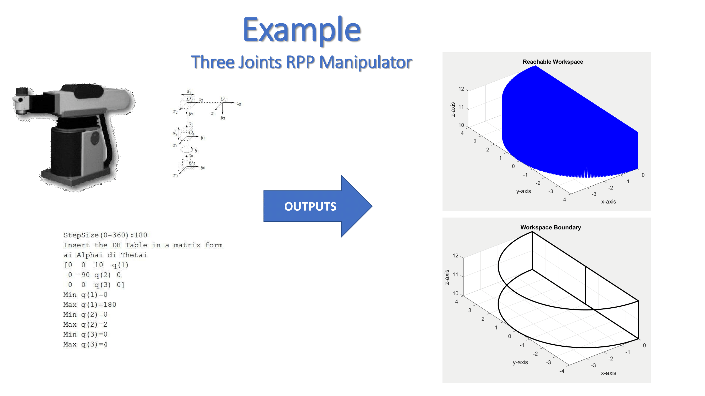

### MATLAB Code
The "GenerateManipWorkspace.m" file generates a three-dimensional workspace graphical representation of any n-DOF serial robotic manipulator by taking a DH-Table as an input. 

### Output
It also computes the transformation matrix of the end effector with respect to its base as well as the Jacobian matrix.

### Plots
Two plots are generated, the first represent a point cloud whereas the second represent the workspace boundaries. 

### Example
An example of 3-DOF RPP Manipulator is included for demonstration purposes:

